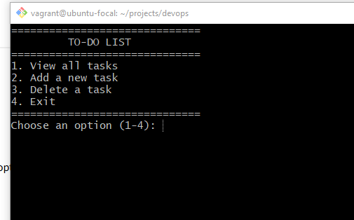
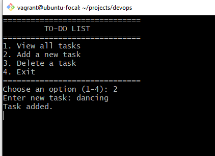
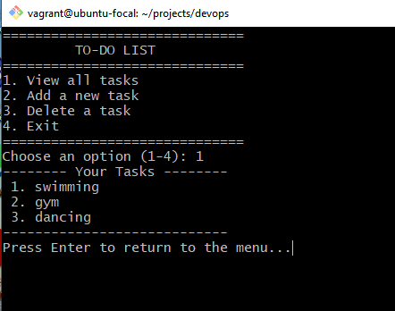
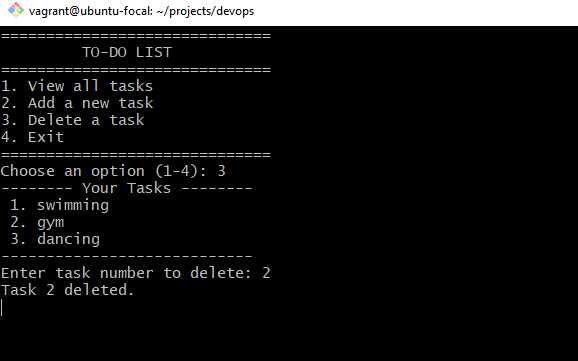
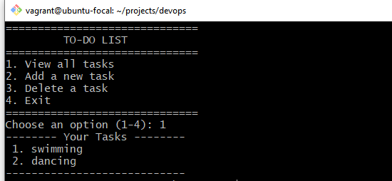
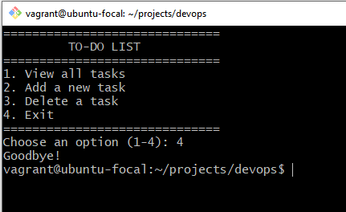

# Shell-Fundamentals
This script Display a menu of todo with the following options:
- View all tasks
- Add a new task
- Delete a task
- Exit the program

  

We used `echo command` to display those view and `read command` to collect user's import from either 1 to 4.  

 

Pressing 2, you are about to add a new todo to your list file.  

Likewise to view your saved todo list, you will press 1 on the keyboard.

  

from the output, we used `nl -w2 -s'. ' "$TODO_FILE"`
- `nl` is used for numbering lines in a file
- `-w2` used to set the line width to 2
- `-s`, ' Set the separator between the line number and the line text to a period.

  

We remove some item from the todo list by pressing 4. But before removing it we need to check if the variable is a positive of only digit.
We used this command to check `if [[ $del_num =~ ^[0-9]+$ ]];`
Also we used `sed -i "${del_num}d" "$TODO_FILE"` command to check if the number is valid, then we run a `sed command` to delete the corresponding line number from the file.
- `-i` means to edit the file in-place
- `"${del_num}d"` this to  delete the line at number $del_num
- `"$TODO_FILE"` this is the file we are working on

To exit from the program, just press 4  and the program will be closed.  

